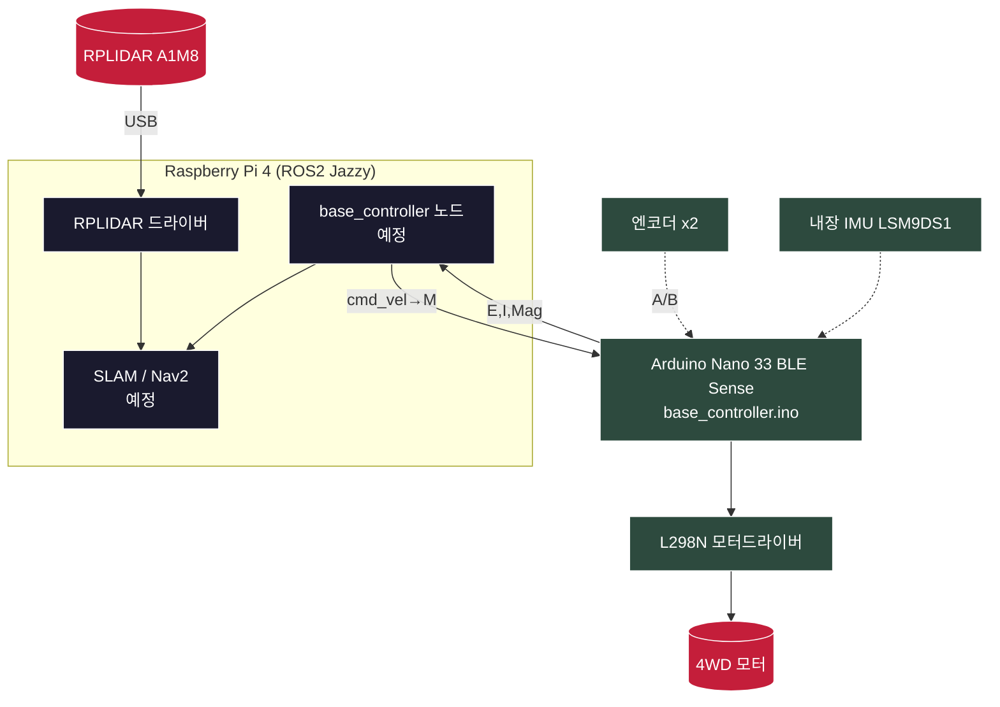

# 🤖 ROS2 Autonomous Exploration Robot

> 라즈베리파이 + 아두이노 + LiDAR로 자작한 ROS2 기반 자율주행 탐사로봇 — SLAM 맵핑 · 장애물 회피 · 물체 탐지 · Unity 관제


---

## 📋 Overview

**ROS2 Autonomous Exploration Robot**은 시판 로봇 키트가 아닌 **자체 제작 4WD 차동구동 로봇**을 ROS2 생태계에 통합하는 프로젝트입니다. 학원에서 TurtleBot3로 학습한 SLAM/Nav2를, 직접 만든 하드웨어 위에서 동작시키는 것을 목표로 합니다.

TurtleBot3가 "완성된 로봇을 사용"하는 것이라면, 본 프로젝트는 **"로봇을 ROS에 연결되게 만드는"** 과정 — 즉 모터·엔코더·IMU 펌웨어, 시리얼 통신, URDF, odometry까지 직접 구축합니다.

| 항목 | 사양 |
| --- | --- |
| 제어 보드 | Arduino Nano 33 BLE Sense (3.3V, IMU 내장) |
| 메인 컴퓨터 | Raspberry Pi 4 (4GB) |
| OS / 미들웨어 | Ubuntu 24.04 / ROS2 Jazzy |
| 구동 | 4WD 차동구동 (엔코더 TT모터 2 + 일반 TT모터 2) |
| 개발 기간 | 2026– |

---

## ✨ Features

### 🔧 통합 펌웨어 (Arduino)

- 모터 제어 (전진 / 후진 / 제자리 회전)
- 엔코더 좌·우 독립 쿼드라처 카운트
- 내장 IMU(LSM9DS1) 가속도 · 자이로 · 지자계
- 0.5초 명령 타임아웃 안전 정지
- IMU 미연결 시에도 동작하는 fallback

### 📡 시리얼 통신 (UART)

- 아두이노 ↔ 라즈베리파이 GPIO UART, 115200 baud
- 50Hz 엔코더·IMU 송신 / 10Hz 지자계 송신
- 텍스트 프로토콜 (`M` 수신 / `E` `I` `Mag` 송신)

### 🗺️ ROS2 통합

- `cmd_vel` → 차동구동 역기구학 → 모터 명령 ✅
- 엔코더 기반 `/odom`, `/imu/data_raw`, `/imu/mag` 발행 ✅
- 키보드 텔레옵 노드 (누적 속도형, 수동 주행) ✅
- RPLIDAR `/scan` 발행 ✅
- SLAM 맵핑, Nav2 자율주행 (예정)
---

## 🏗️ Architecture



**핵심 설계 원칙**:

1. **한 번에 한 단계씩 검증**: 각 부품(모터→엔코더→IMU→통신)을 독립적으로 검증한 뒤에만 다음 단계로. 멀티미터·오실로스코프·시리얼로 눈에 보이는 증거 확보.
2. **아두이노는 ROS를 모른다**: 아두이노는 단순 시리얼 프로토콜만 담당. ROS 변환은 전부 라즈베리파이 노드에서. 역할 분리로 디버깅 단순화.
3. **raw 데이터 우선**: IMU는 융합하지 않고 raw로 송신. 센서 융합(방향 계산)은 ROS의 `imu_filter_madgwick`에 위임.

---

## 🛠️ Tech Stack

- **Firmware**: Arduino C++ (mbed core), Arduino_LSM9DS1
- **Middleware**: ROS2 Jazzy (ros-base)
- **Communication**: UART Serial (`/dev/ttyAMA0`, 115200)
- **Sensors**: LSM9DS1 IMU, 쿼드라처 엔코더, RPLIDAR A1M8-R6
- **Planned**: slam_toolbox, Nav2, Unity (관제 UI)

---

## 📁 Project Structure

```
autonomous-robot/
├── README.md
├── firmware/
│   ├── base_controller.ino          # 통합 펌웨어 (UART 버전, 메인)
│   └── base_controller_usb_ref.ino  # USB 시리얼 버전 (참고용)
├── docs/
│   ├── 인수인계.md                   # 진행 내역 + 디버깅 노트
│   └── ros2_설치.txt                 # ROS2 Jazzy 설치 명령어
└── ros2_ws/src/autonomous_robot/     # base_controller 노드, URDF, launch
```

---

## 🚀 Getting Started

### Hardware Wiring

| 연결 | 핀 |
| --- | --- |
| L298N IN1~IN4 (모터 방향) | Arduino D2~D5 |
| 엔코더 좌/우 A·B | Arduino D6~D9 |
| 아두이노 ↔ Pi UART | D1(TX)→Pi핀10, D0(RX)→Pi핀8, GND→Pi핀6 |
| 엔코더 VCC | Arduino 3.3V (⚠️ 5V 금지) |

### Firmware

```
firmware/base_controller.ino 를 Arduino IDE로 업로드
보드: Arduino Nano 33 BLE / 라이브러리: Arduino_LSM9DS1
```

### Raspberry Pi UART

```bash
# /boot/firmware/config.txt 에 추가
enable_uart=1
dtoverlay=disable-bt        # PL011(ttyAMA0)을 GPIO로

# 사용자를 dialout 그룹에 추가
sudo usermod -aG dialout $USER
```

ROS2 설치는 [`docs/ros2_설치.txt`](docs/ros2_설치.txt) 참고.
```

### Run (ROS2)

```bash
# 1. 로봇 시스템 (모터·IMU·카메라)
ros2 launch autonomous_robot robot.launch.py

# 2. 키보드 수동 조종 (별도 터미널)
ros2 run autonomous_robot teleop_node
#   w 전진 / x 후진 / a 좌회전 / d 우회전 / s 정지 / q 종료
#   같은 키 반복 = 속도 단계 상승, s 누르기 전까지 계속 이동

# 3. RPLIDAR (별도 터미널)
ros2 launch rplidar_ros rplidar.launch.py \
  serial_port:=/dev/ttyUSB0 serial_baudrate:=115200 frame_id:=laser

---

## 🔑 가장 큰 발견: 변수를 줄이고, 측정으로 증명한다

자작 로봇의 디버깅은 "어디가 문제인지 모른다"가 가장 큰 적이었습니다. 추측 대신 **측정으로 범위를 좁히는** 워크플로우를 반복 적용했습니다.

```
모터가 안 돈다 (시리얼은 정상)
  → 손 테스트(아두이노 분리, IN1→5V 직결)로 L298N/모터 자체 검증
  → 멀티미터로 IN1 핀 전압 측정 (신호 도달 여부)
  → 멀티미터로 GND 공통 확인
  → 원인: ENA 인에이블 / GND 누락 등으로 분기
```

UART 통신 실패도 같은 방식으로 잡았습니다 — **오실로스코프로 신호가 Pi 핀까지 도달함을 확인**한 뒤, 문제를 "배선"이 아닌 "포트 설정"으로 좁혀 `ttyS0 → ttyAMA0` 전환으로 해결했습니다.

---

## 🐛 Troubleshooting

| 이슈 | 원인 | 해결 |
| --- | --- | --- |
| **모터 안 돎 (시리얼 정상)** | ENA/ENB 인에이블 OFF 또는 GND 공통 누락 | 점퍼캡 확인 / 아두이노-L298N GND 연결 |
| **BNO055 I2C 인식 실패** | 클론 모듈 불량 (SDA 라인 0V 고착) | 내장 IMU(LSM9DS1) 보드로 전환 |
| **Nano 33 BLE 시리얼 모니터 무출력** | 네이티브 USB 재연결 실패 | 리셋 버튼 + `delay(3000)` |
| **UART 데이터 안 옴 (신호는 핀 도달)** | `ttyS0`가 GPIO에 미연결, BT가 PL011 점유 | `dtoverlay=disable-bt` → `ttyAMA0` 사용 |
| **`Permission denied: ttyAMA0`** | dialout 그룹 미소속 | `usermod -aG dialout` 후 재로그인 |
| **apt `Conflicting Signed-By`** | ROS 저장소 설정 중복(.list + .sources) | 구방식 `ros2.list` 삭제 |
| **모터 간헐 작동 / 안 돎 (신호 정상)** | 보조배터리 1개로 Pi+아두이노 공급 시 전력 부족(brownout) | 아두이노 독립/고출력 전원, GND 공통 |
| **아두이노 주황 LED 깜빡 (부트로더)** | 전원 인가 시 부트로더 모드 진입 | 리셋 버튼 1회 → 펌웨어 실행 |

자세한 디버깅 과정은 [`docs/인수인계.md`](docs/인수인계.md) 참고.

---

## 🛣️ Roadmap

- [x] **Phase 1**: 모터 · 엔코더 · IMU 개별 검증
- [x] **Phase 2**: 통합 펌웨어 + 시리얼 프로토콜
- [x] **Phase 3**: 아두이노 ↔ Pi UART 통신 (`/dev/ttyAMA0`)
- [x] **Phase 4**: 라즈베리파이 ROS2 Jazzy 설치
- [x] **Phase 5**: PWM 속도 제어 추가
- [x] **Phase 6**: base_controller ROS2 노드 (cmd_vel ↔ 시리얼)
- [x] **Phase 7**: URDF + odometry
- [x] **Phase 8**: 키보드 텔레옵 (수동 주행) + RPLIDAR `/scan` 연동
- [ ] **Phase 9**: SLAM 맵핑 (slam_toolbox)
- [ ] **Phase 10**: Nav2 자율주행
- [ ] **Phase 11**: 카메라 물체 탐지 + 촬영·전송
- [ ] **Phase 12**: Unity 관제 UI

---

## 📚 References

- [ROS2 Jazzy Documentation](https://docs.ros.org/en/jazzy/)
- [Arduino Nano 33 BLE Sense](https://docs.arduino.cc/hardware/nano-33-ble-sense)
- [slam_toolbox](https://github.com/SteveMacenski/slam_toolbox)
- [Nav2](https://navigation.ros.org/)

---

## 📜 License

본 프로젝트의 코드는 [MIT License](LICENSE)를 따릅니다.

---

**Author**: Aeri Kim · [GitHub](https://github.com/kimar1022-code) · [Email](mailto:kimar1022@gmail.com)

> 본 프로젝트는 AI 페어 프로그래밍 도구(Anthropic Claude)를 활용하여 개발되었으며, 하드웨어 설계·디버깅·시스템 결정은 작성자가 주도하였습니다.
