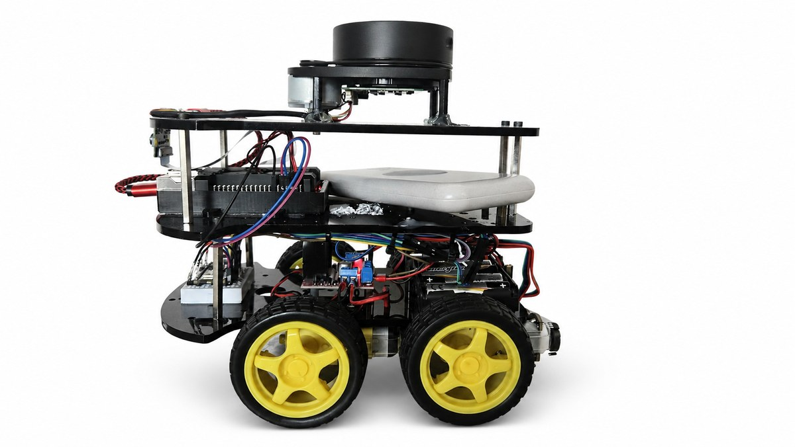
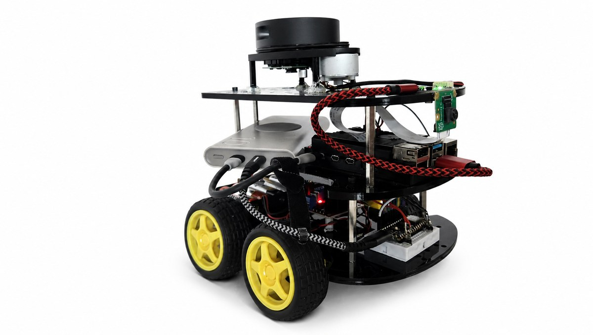
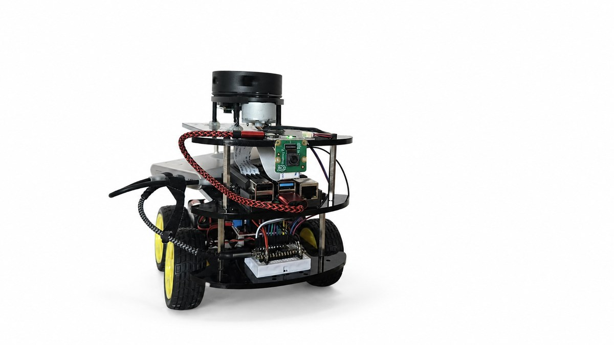
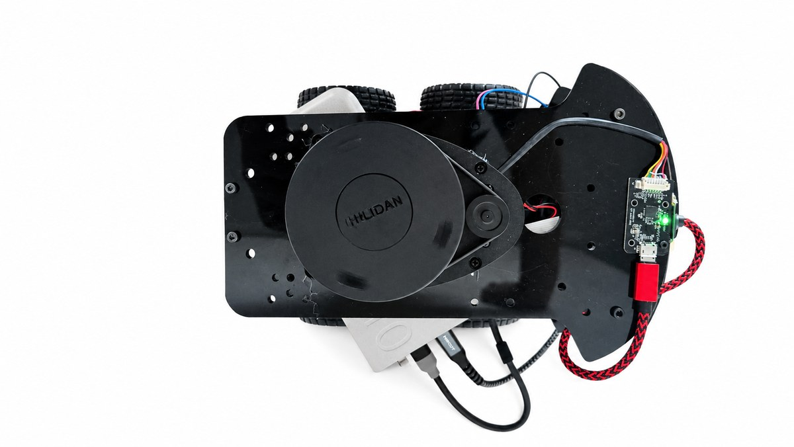
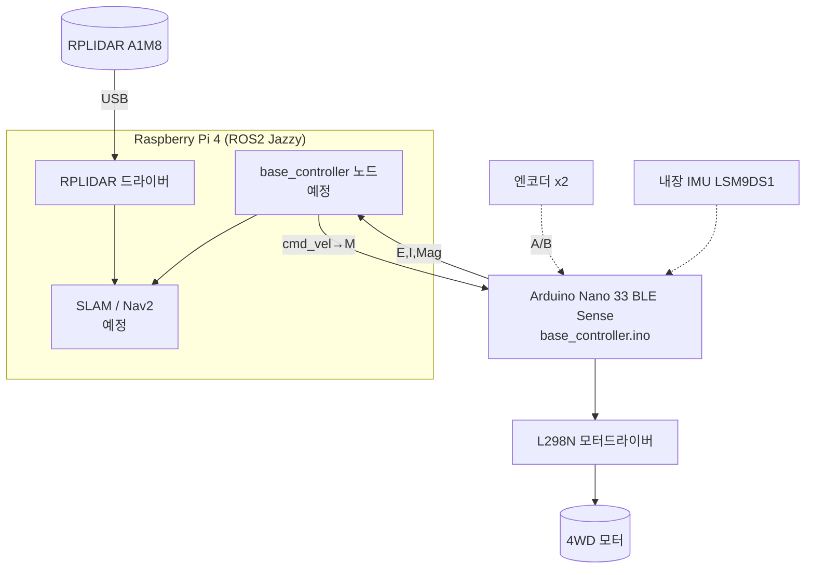

# Autonomous Exploration Robot

시판 키트가 아니라 직접 만든 4WD 차동구동 로봇을 ROS2에 통합하는 프로젝트입니다.
TurtleBot3로 배운 SLAM/Nav2를 자작 하드웨어 위에서 동작시키는 것이 목표입니다.

TurtleBot3가 "완성된 로봇을 사용"하는 것이라면, 이 프로젝트는 로봇을 ROS에 연결되게
만드는 과정 자체 — 모터·엔코더·IMU 펌웨어, 시리얼 통신, URDF, odometry — 를 직접 구축합니다.



| 항목 | 사양 |
| --- | --- |
| 제어 보드 | Arduino Nano 33 BLE Sense (3.3V, IMU 내장) |
| 메인 컴퓨터 | Raspberry Pi 4 (4GB) |
| OS / 미들웨어 | Ubuntu 24.04 / ROS2 Jazzy |
| 구동 | 4WD 차동구동 (엔코더 TT모터 2 + 일반 TT모터 2) |
| 개발 기간 | 2026– |

## 현재까지 된 것

통합 펌웨어 (Arduino)
- 모터 제어 (전진 / 후진 / 제자리 회전)
- 엔코더 좌·우 독립 쿼드라처 카운트
- 내장 IMU(LSM9DS1) 가속도·자이로·지자계
- 0.5초 명령 타임아웃 안전 정지, IMU 미연결 시에도 동작하는 fallback

시리얼 통신 (UART)
- 아두이노 ↔ 라즈베리파이 GPIO UART, 115200 baud
- 50Hz 엔코더·IMU 송신 / 10Hz 지자계 송신
- 텍스트 프로토콜 (`M` 수신 / `E` `I` `Mag` 송신)

ROS2 통합
- `cmd_vel` → 차동구동 역기구학 → 모터 명령
- 엔코더 기반 `/odom`, `/imu/data_raw`, `/imu/mag` 발행
- 키보드 텔레옵 노드 (누적 속도형, 수동 주행)
- RPLIDAR `/scan` 발행
- SLAM 맵핑, Nav2 자율주행은 진행 중

## 하드웨어

2층 아크릴 섀시. 아래층에 모터·L298N·배터리를, 위층에 라즈베리파이와 아두이노를 올렸다.
LiDAR 는 스캔이 가려지지 않도록 맨 위 중앙에 세웠다.

| 왼쪽 | 오른쪽 |
| --- | --- |
|  |  |
| 앞 | 위 |
|  |  |

## 구조


```mermaid
flowchart TD
    subgraph Pi["Raspberry Pi 4 (ROS2 Jazzy)"]
        BC[base_controller 노드<br/>예정]
        SLAM[SLAM / Nav2<br/>예정]
        LIDAR_DRV[RPLIDAR 드라이버]
    end

    Ardu[Arduino Nano 33 BLE Sense<br/>base_controller.ino]
    L298N[L298N 모터드라이버]
    Motor[(4WD 모터)]
    Enc[엔코더 x2]
    IMU[내장 IMU LSM9DS1]
    Lidar[(RPLIDAR A1M8)]

    BC -->|cmd_vel→M| Ardu
    Ardu -->|E,I,Mag| BC
    Ardu --> L298N --> Motor
    Enc -.->|A/B| Ardu
    IMU -.-> Ardu
    Lidar -->|USB| LIDAR_DRV
    LIDAR_DRV --> SLAM
    BC --> SLAM
```

설계에서 지킨 것:

1. 한 번에 한 단계씩 검증 — 각 부품(모터→엔코더→IMU→통신)을 독립적으로 검증한 뒤에만 다음 단계로. 멀티미터·오실로스코프·시리얼로 눈에 보이는 증거를 확보.
2. 아두이노는 ROS를 모른다 — 아두이노는 단순 시리얼 프로토콜만 담당하고, ROS 변환은 전부 라즈베리파이 노드에서. 역할 분리로 디버깅이 단순해짐.
3. raw 데이터 우선 — IMU는 융합하지 않고 raw로 송신. 센서 융합은 ROS의 `imu_filter_madgwick`에 위임.

## 파일 구성

```
autonomous-robot/
├── firmware/
│   ├── base_controller.ino          # 통합 펌웨어 (UART 버전, 메인)
│   └── base_controller_usb_ref.ino  # USB 시리얼 버전 (참고용)
├── docs/
│   ├── 인수인계.md                   # 진행 내역 + 디버깅 노트
│   └── ros2_설치.txt                 # ROS2 Jazzy 설치 명령어
└── ros2_ws/src/autonomous_robot/     # base_controller 노드, URDF, launch
```

## 실행

### 배선

| 연결 | 핀 |
| --- | --- |
| L298N IN1~IN4 (모터 방향) | Arduino D2~D5 |
| 엔코더 좌/우 A·B | Arduino D6~D9 |
| 아두이노 ↔ Pi UART | D1(TX)→Pi핀10, D0(RX)→Pi핀8, GND→Pi핀6 |
| 엔코더 VCC | Arduino 3.3V (5V 금지) |

펌웨어는 `firmware/base_controller.ino`를 Arduino IDE로 업로드합니다.
보드: Arduino Nano 33 BLE / 라이브러리: Arduino_LSM9DS1.

라즈베리파이 UART 설정:

```bash
# /boot/firmware/config.txt 에 추가
enable_uart=1
dtoverlay=disable-bt        # PL011(ttyAMA0)을 GPIO로

# 사용자를 dialout 그룹에 추가
sudo usermod -aG dialout $USER
```

ROS2 설치는 [docs/ros2_설치.txt](docs/ros2_설치.txt) 참고.

```bash
# 1. 로봇 시스템 (모터·IMU·카메라)
ros2 launch autonomous_robot robot.launch.py

# 2. 키보드 수동 조종 (별도 터미널)
ros2 run autonomous_robot teleop_node
#   w 전진 / x 후진 / a 좌회전 / d 우회전 / s 정지 / q 종료
#   같은 키 반복 = 속도 단계 상승, s 누르기 전까지 계속 이동

# 3. RPLIDAR (별도 터미널)
ros2 launch rplidar_ros rplidar.launch.py \
  serial_port:=/dev/ttyUSB0 serial_baudrate:=115200 frame_id:=laser
```

## 디버깅 방식

자작 로봇은 "어디가 문제인지 모른다"가 가장 큰 적이었습니다. 추측 대신 측정으로
범위를 좁히는 순서를 반복해서 썼습니다.

```
모터가 안 돈다 (시리얼은 정상)
  → 손 테스트(아두이노 분리, IN1→5V 직결)로 L298N/모터 자체 검증
  → 멀티미터로 IN1 핀 전압 측정 (신호 도달 여부)
  → 멀티미터로 GND 공통 확인
  → 원인: ENA 인에이블 / GND 누락 등으로 분기
```

UART 통신 실패도 같은 방식으로 잡았습니다. 오실로스코프로 신호가 Pi 핀까지 도달함을
확인한 뒤 문제를 배선이 아닌 포트 설정으로 좁혔고, `ttyS0 → ttyAMA0` 전환으로 해결했습니다.

## 트러블슈팅

| 이슈 | 원인 | 해결 |
| --- | --- | --- |
| 모터 안 돎 (시리얼 정상) | ENA/ENB 인에이블 OFF 또는 GND 공통 누락 | 점퍼캡 확인 / 아두이노-L298N GND 연결 |
| BNO055 I2C 인식 실패 | 클론 모듈 불량 (SDA 라인 0V 고착) | 내장 IMU(LSM9DS1) 보드로 전환 |
| Nano 33 BLE 시리얼 모니터 무출력 | 네이티브 USB 재연결 실패 | 리셋 버튼 + `delay(3000)` |
| UART 데이터 안 옴 (신호는 핀 도달) | `ttyS0`가 GPIO에 미연결, BT가 PL011 점유 | `dtoverlay=disable-bt` → `ttyAMA0` 사용 |
| `Permission denied: ttyAMA0` | dialout 그룹 미소속 | `usermod -aG dialout` 후 재로그인 |
| apt `Conflicting Signed-By` | ROS 저장소 설정 중복(.list + .sources) | 구방식 `ros2.list` 삭제 |
| 모터 간헐 작동 (신호 정상) | 보조배터리 1개로 Pi+아두이노 공급 시 전력 부족 | 아두이노 독립/고출력 전원, GND 공통 |
| 아두이노 주황 LED 깜빡 (부트로더) | 전원 인가 시 부트로더 모드 진입 | 리셋 버튼 1회 → 펌웨어 실행 |

자세한 디버깅 과정은 [docs/인수인계.md](docs/인수인계.md)에 있습니다.

## 진행 상태

- [x] 모터·엔코더·IMU 개별 검증
- [x] 통합 펌웨어 + 시리얼 프로토콜
- [x] 아두이노 ↔ Pi UART 통신 (`/dev/ttyAMA0`)
- [x] 라즈베리파이 ROS2 Jazzy 설치
- [x] PWM 속도 제어
- [x] base_controller ROS2 노드 (cmd_vel ↔ 시리얼)
- [x] URDF + odometry
- [x] 키보드 텔레옵 + RPLIDAR `/scan` 연동
- [ ] SLAM 맵핑 (slam_toolbox)
- [ ] Nav2 자율주행
- [ ] 카메라 물체 탐지 + 촬영·전송
- [ ] Unity 관제 UI

## 참고 자료

- [ROS2 Jazzy Documentation](https://docs.ros.org/en/jazzy/)
- [Arduino Nano 33 BLE Sense](https://docs.arduino.cc/hardware/nano-33-ble-sense)
- [slam_toolbox](https://github.com/SteveMacenski/slam_toolbox)
- [Nav2](https://navigation.ros.org/)

## 라이선스

[MIT License](LICENSE)
